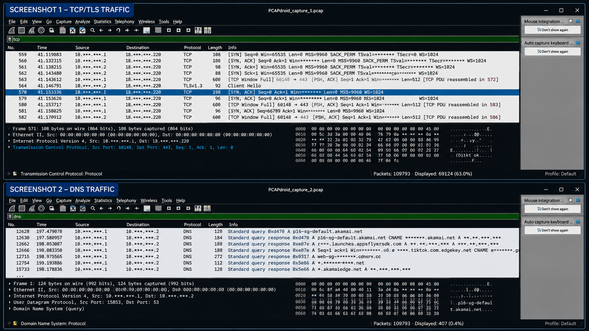

# Network Traffic Analysis Using PCAPdroid and Wireshark

## Project Overview

This project demonstrates the capture and analysis of network traffic using PCAPdroid and Wireshark.

The objective was to examine captured network packets, identify network protocols, analyze communication between hosts, and document security-relevant observations.

## Objectives

- Capture network traffic using PCAPdroid
- Analyze packet captures using Wireshark
- Identify network protocols
- Examine source and destination IP addresses
- Analyze ports and network connections
- Identify potentially unusual traffic patterns
- Document findings and security observations

## Tools Used

- PCAPdroid
- Wireshark
- PCAP/PCAPNG
- TCP/IP
- Windows/Linux

## Skills Demonstrated

- Network traffic analysis
- Packet analysis
- Protocol identification
- IP address analysis
- Port analysis
- Basic network security investigation
- Technical documentation

## Methodology

1. Captured network traffic using PCAPdroid.
2. Exported the captured traffic for analysis.
3. Opened the capture in Wireshark.
4. Examined protocols and packet information.
5. Investigated source and destination addresses.
6. Examined network ports and communication patterns.
7. Documented observations and findings.

## Findings

Findings from the network traffic analysis will be documented here.

## Screenshots

## Screenshots

### Wireshark TCP/TLS and DNS Traffic Analysis

The following sanitized screenshot demonstrates packet analysis performed in Wireshark. Sensitive network information has been masked for privacy.

## Conclusion

This project provided practical experience in network traffic capture and packet analysis and improved my understanding of how network communications can be investigated from a cybersecurity perspective.
